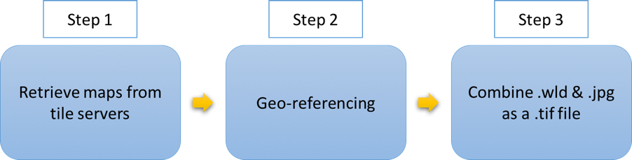
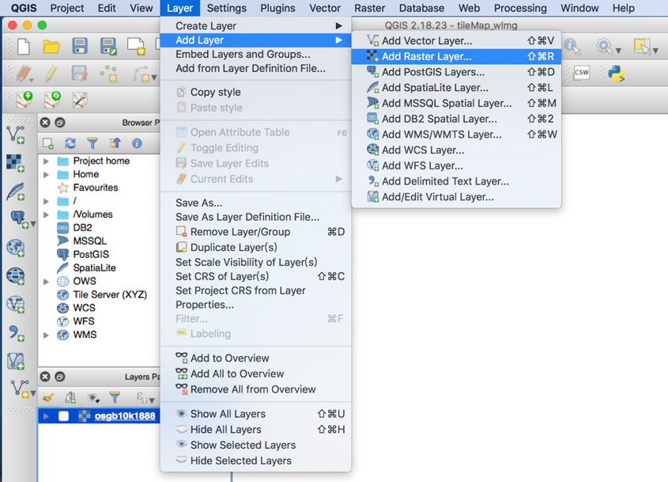
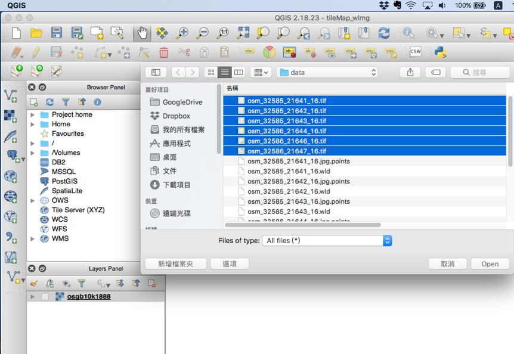

# Maptile Retrieval from Esri, OSM, StamenMaps and Historical mapservers

## To download Esri Imageries for Region of Interest (ROI):
1. Specify the bounding box of the ROI in lat long as json:
- See example in `paris.json`
- Eg.: 
```json
{
  "paris": {
    "xmin": 2.125608,
    "ymin": 48.758445,
    "xmax": 2.564374,
    "ymax": 48.992376,
    "z": 14
  }
}
```
2. Run the following commnad:
```bash
python downloader.py ./latlngs.json  -ts 'esri' -s 'imagery' -o './outs' 
```
- `./latlngs.json`: path to the json file for your ROI
- `-ts`: tile server name to use. See `tile_sources.py` for tileserver we support
- `-s`: style of the maptile. Use `imagery` for satellite images from Esri
- `./outs`: output directory to store the retrieved maptiles. (will be created if not existing already)


## Historical Map Retrieval
The workflow for historical map retrival is as following



## Retrieve Map Using Tile Indexes

This code can retrieve tiled web map (or slippy map) from different tile servers. 
Given the boundary of desired latitude and longitude, the code will transfer into tile index and retrieve map based on the URL of tile servers.

The output will be map image (jpeg file) and its (latitude, longitude) bounding box (text file).

 `retrieveMap_byxyz _nlsosm.py` retrieves the map tiles from the NLS server and Open Street Map server. 
 
 ## Georeferencing 
 
Run  `generate_wld_file` to generate corresponding world file and point file for jpg files. 

Put the `jpeg`,`.point` and `.wrd` into the *SAME* folder, then run `sh gdal.sh` to feed the resulting world file and jpg files to gdal to convert to geotiff files. Note that you need to change the folder name in `gdal.sh` to point to the correct folder.


## Visualization
 
QGIS can be used to view the geotiff file. 




